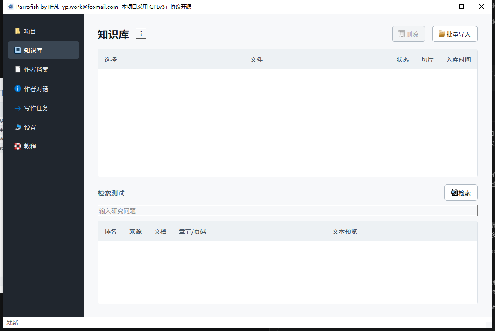
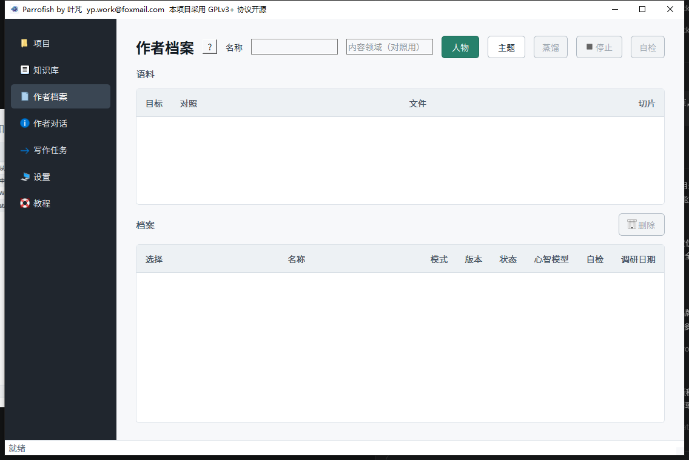
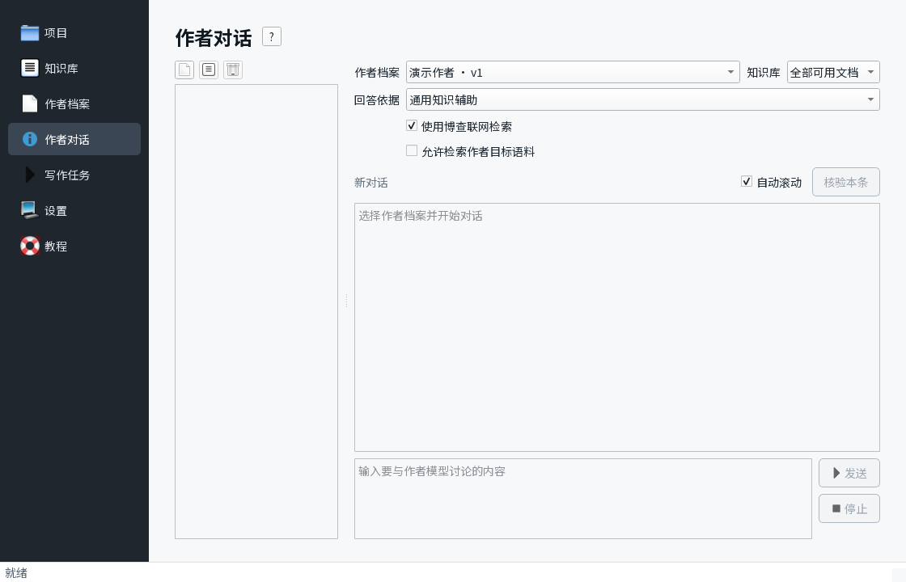
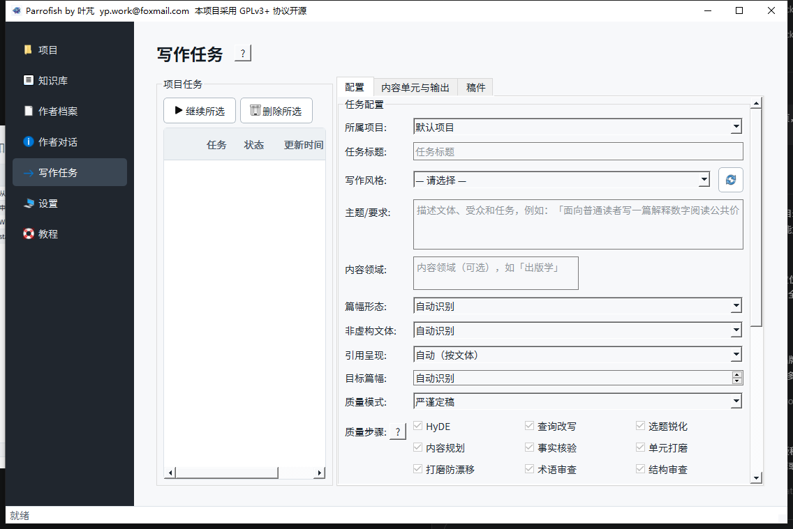
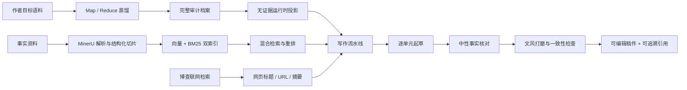

<div align="center">


# Parrofish

**蒸馏作者的思维、谋篇与表达，结合本地知识库与可选联网检索完成可追溯的非虚构创作。**

把“作者怎样思考和表达”与“文章使用哪些事实和证据”严格分开。


[](LICENSE)

[下载 Windows 版](../../releases/latest) · [快速开始](#快速开始) · [可信写作边界](#可信写作边界)

</div>

> [!IMPORTANT]
> 当前 `v0.1.3` 面向 Windows 10/11 x64。Parrofish 不是离线模型：文档解析使用 MinerU，文字生成、向量化和重排使用 SiliconFlow；可选联网检索使用博查 Web Search API。调用可能产生对应服务的额度消耗。

## Parrofish 是什么

Parrofish 是一个面向研究者、编辑、评论者和专业内容创作者的桌面应用。它支持学术论文、研究报告、政策简报、评论、书评、科普、演讲、公众文章、新闻分析、教程、摘要，以及用户明确指定的其他非虚构文本。

它不是一个只会模仿语气的“仿写器”，也不是把资料一次性塞进提示词的聊天壳。Parrofish 将创作拆成两条彼此隔离的通道：

- **作者档案负责形式**：怎样提出问题、组织论证、安排结构、转换段落和选择表达。
- **事实通道负责内容**：本地知识库与用户明确启用的联网检索决定文章可以使用哪些事实、证据和引用。

作者与事实通道只在写作流水线中汇合。作者语料默认不能充当新任务的事实来源，蒸馏证据锚点也不会混入生成上下文；未勾选联网时不会发起博查请求。

## 典型使用场景

| 场景 | 推荐用法 | Parrofish 如何协助 |
|---|---|---|
| 模仿期刊的风格写论文 | 选择同一期刊中同领域、同文体的代表性论文进行**主题蒸馏**，再把自己的研究资料作为事实语料加入知识库。 | 提炼该类文章常见的问题意识、谋篇结构、论证节奏与表达习惯，据此规划和起草新论文；新稿事实与引用仍来自自己的知识库或明确启用的联网检索。 |
| 模仿某位学术大牛写论文 | 选择该学者多篇有代表性的论文进行**人物蒸馏**，需要时加入同领域作者作为对照语料。 | 建立该学者的心智模型、谋篇 DNA 与表达 DNA，用其分析路径和写作规律处理新的研究问题，同时隔离原论文中的事实证据。 |
| 按某位领导的偏好写材料 | 在获得授权并遵守隐私要求的前提下，选择其公开讲话、署名文章或既有材料进行**人物蒸馏**，把本次工作的真实数据和政策依据放入知识库。 | 学习其关注重点、材料结构、信息排序和措辞偏好，辅助起草汇报、讲话、简报等非虚构文本，并通过独立事实通道约束内容。 |

这里的“模仿”是对可观察的思考、谋篇和表达规律进行建模，不是复制原文、冒充真人或推测未公开观点。生成结果仍需用户审核，并遵守著作权、署名、隐私和学术诚信要求。

## 界面预览

<table>
<tr>
<td width="50%"><br><sub>知识库：批量入库、混合检索与来源定位</sub></td>
<td width="50%"><br><sub>作者档案：目标/对照语料、人物/主题蒸馏与版本管理</sub></td>
</tr>
<tr>
<td width="50%"><br><sub>作者对话：可选知识库与联网检索、流式 Markdown、历史摘要</sub></td>
<td width="50%"><br><sub>写作任务：文体、篇幅、本地/联网事实来源和质量步骤均可配置</sub></td>
</tr>
</table>

## 核心能力

| 模块 | 能力 |
|---|---|
| 本地知识库 | 批量导入 PDF、Word、PPT 和 UTF-8 TXT；保留页码、章节、字符区间与父子切片；使用向量检索、BM25/jieba、RRF 和 rerank 组合检索。 |
| 可选联网检索 | 作者对话和写作任务可按次启用博查 Web Search；结果保留标题、URL、站点与发布时间，未勾选时完全不调用。 |
| 人物/主题蒸馏 | 从多篇目标语料提炼心智模型、表达 DNA 与跨文档规律；人物和主题模式均支持跨文档聚类与留出生成力检验，并支持四种质量模式、精确续跑、增量升级、矛盾保留和信息不足重判。人物模式还可使用对照语料判断作者区分度。 |
| 谋篇 DNA | 按文体分析全文、章节、段落、句群和过渡五个尺度，不把论文、演讲、评论等平均成同一个固定模板。 |
| 专业写作 | 支持知识库事实写作与 0 语料的无事实构思；按“创作意图 → 内容规划 → 证据锁定与起草 → 中性核对 → 文风打磨 → 全局一致性”生成可编辑稿件。 |
| 事实与引用 | 事实论断必须绑定本地文档或联网网页来源；核对不通过则修订或终止；参考文献由代码按 GB/T 7714 拼装，而不是让模型手写。 |
| 作者对话 | 固定作者档案版本进行探索性对话；默认以通用知识辅助作者认知与表达，也可切换严格证据；支持可选知识库、联网检索、流式 Markdown、会话历史与滚动摘要。 |
| 可恢复任务 | 蒸馏 Map、结构画像、内容单元、核对结果和聊天消息逐步持久化；长任务失败后可从已完成断点继续。 |
| 可观测配置 | 实时查看模型流式输出和当前步骤耗时；统一设置并发、超时与模型，并可单独配置每个文字生成步骤。 |

## 工作流



## 快速开始

### 普通用户

1. 在 [Releases](../../releases/latest) 下载 `Parrofish-Setup-<版本>-x64.exe`。
2. 运行安装程序。Parrofish 按用户安装，不需要管理员权限，卸载时会保留用户数据。
3. 打开“设置”，配置 SiliconFlow API 与 MinerU API；需要联网检索时再配置博查 API。
4. 在“知识库”批量导入事实资料，等待状态变为“可检索”。
5. 如需使用作者模型，在“作者档案”选择目标语料和可选对照语料后运行蒸馏。
6. 使用“作者对话”探索问题，或在“写作任务”中创建可恢复的正式创作任务；按需勾选博查联网检索。

发行页同时提供以下文件：

| 文件 | 用途 |
|---|---|
| `Parrofish-Setup-<版本>-x64.exe` | 推荐给普通用户的安装版；应用程序不显示控制台窗口。 |
| `Parrofish-Portable-<版本>-x64.zip` | 解压后运行 `Parrofish.exe` 的免安装版。 |
| `Parrofish-Source-<版本>.zip` | 对应版本的干净源码包。 |
| `SHA256SUMS.txt` | 用于核对下载文件完整性。 |

### API 获取

- [SiliconFlow 注册入口](https://cloud.siliconflow.cn/i/j7F36Uco)：注册并登录后进入“API 密钥”，创建并复制以 `sk-` 开头的密钥。
- [MinerU 官网](https://mineru.net/)：登录后进入“API → API 管理”，创建并复制 Token。
- [博查 AI 开放平台](https://open.bochaai.com/)：注册并进入控制台创建 API Key；只有任务中勾选联网时才会调用。

密钥请只粘贴到 Parrofish 设置页。软件通过系统凭据库保存密钥，不会把它们写入普通配置文件；不要在 Issue、日志或截图中公开密钥。

## 从源码运行

### 环境要求

- Windows 10/11 x64
- Python `3.12`
- [`uv`](https://docs.astral.sh/uv/)

项目已经配置清华 PyPI 镜像。在仓库根目录执行：

```powershell
uv sync --all-groups --index-url https://pypi.tuna.tsinghua.edu.cn/simple
uv run writing-factory
```

运行离线测试：

```powershell
uv run pytest
```

真实 SiliconFlow、MinerU 与博查集成测试默认跳过，只有显式设置对应的 `RUN_LIVE_*` 环境变量后才会调用远程服务和消耗额度。

Windows 发行版构建说明见 [packaging/README.md](packaging/README.md)。

## 可信写作边界

Parrofish 的生成链遵守八条设计铁律：

1. **职责分离**：作者档案只管思维、谋篇与表达；本地知识库和明确启用的联网检索只管事实、证据与引用。
2. **先检索，后写作**：每个内容单元先锁定证据，再允许模型起草。
3. **事实论断必须有来源**：没有证据的内容只能作为明确标注的解释、推断或待核实项。
4. **先冻结事实，最后加入文风**：事实核对通过后才进行表达打磨，不能为了“像作者”而改坏事实。
5. **不让作者校验自己**：事实核对使用不带作者档案的中性角色。
6. **引用由代码拼装**：模型只返回内部来源键，正式引文和参考文献由程序生成。
7. **证据必须可追溯**：本地引用回到真实文档、页码和精确小块；联网引用保留网页标题、URL、站点与发布时间，并明确其证据是搜索摘要。
8. **生成阶段只读**：不可信文档和网页摘要进入上下文时，模型没有执行代码、写文件、自主联网或操作外部系统的工具。

> [!WARNING]
> 作者档案是特定语料与调研截止日期下的结构化模型，不等同于真人，不代表作者未公开的想法，也无法捕捉直觉和灵感。用户应尊重著作权、隐私、署名规范与所在机构的学术诚信要求。

## 数据与隐私

- 项目、知识库、作者档案、聊天记录、任务断点和稿件默认保存在本机 `%LOCALAPPDATA%\Parrofish`。
- 用户选择的文档内容和提示词会按功能需要发送给 MinerU 或 SiliconFlow；勾选联网检索时，查询还会发送给博查。Parrofish 不是端到端离线软件。
- 目标作者语料默认从新任务的事实来源中隔离，只有用户明确授权时才允许复用。
- 知识库文本、联网搜索摘要和历史消息均按不可信数据处理，进入提示词前经过边界标记与注入检测。
- 卸载应用不会自动删除用户数据，避免误删知识库和长任务断点。

## 技术栈

| 层级 | 技术 |
|---|---|
| 桌面界面 | PyQt6 + QThread worker |
| 数据与断点 | SQLite + LangGraph SQLite checkpointer |
| 稠密检索 | LanceDB + SiliconFlow embedding |
| 稀疏检索 | BM25 + jieba |
| 重排 | SiliconFlow rerank |
| 文档解析 | MinerU API |
| 联网检索 | 博查 Web Search API（可选） |
| 引用格式 | citeproc-py，默认 GB/T 7714-2015 |
| 模型调用 | 统一 SiliconFlow 客户端，支持流式输出、缓存、重试、超时、并发和用量日志 |

代码按 `config / llm / store / kb / distill / generate / orchestration / eval / ui` 分层。所有业务模块通过统一外部服务客户端调用 SiliconFlow、MinerU 与博查，不在各处散落裸 HTTP 请求。

## 致谢

- 作者蒸馏方法论参考 [Nüwa](https://github.com/alchaincyf/nuwa-skill)，Parrofish 运行时不依赖 Nüwa 本体。
- 文档解析由 [MinerU](https://mineru.net/) API 提供。
- LLM、embedding 与 rerank 通过 [SiliconFlow](https://siliconflow.cn/) API 调用。
- 可选 Web Search 通过 [博查 AI 开放平台](https://open.bochaai.com/) API 调用。

## 许可证

Parrofish 源代码采用 [GNU General Public License v3.0 or later](LICENSE)，SPDX 标识符为 `GPL-3.0-or-later`。

用户导入的文档、知识库、作者档案、项目数据和使用本软件生成的内容，不会仅因使用 Parrofish 而适用 GPL；这些内容的权利仍由其原权利人或用户依法享有。用户仍需自行确保导入语料和生成内容的使用符合法律及原始授权。

第三方依赖继续适用各自的许可证。Parrofish 名称和图标用于标识本项目，GPL 不授予以其名义发布修改版或造成官方背书误解的商标性权利。

Copyright (C) 2026 叶芃 <yp.work@foxmail.com>
