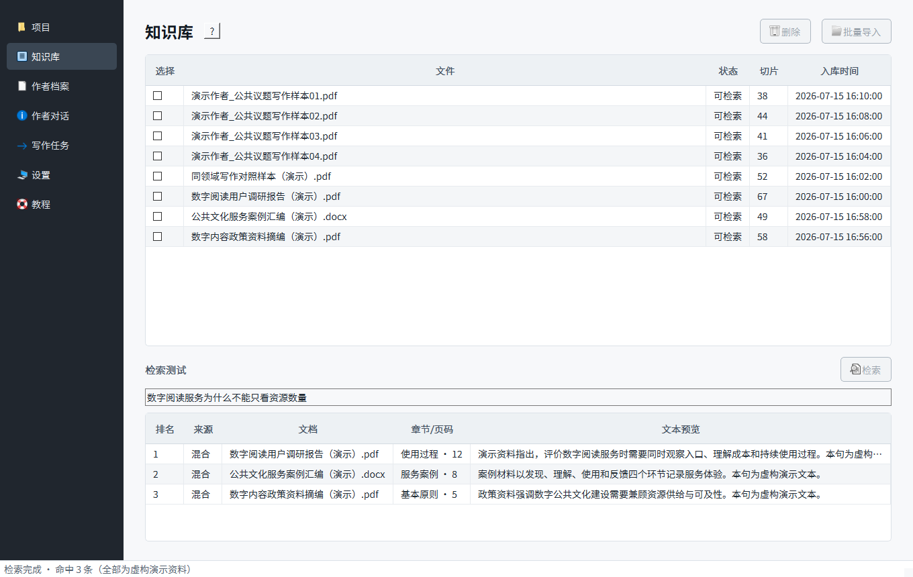
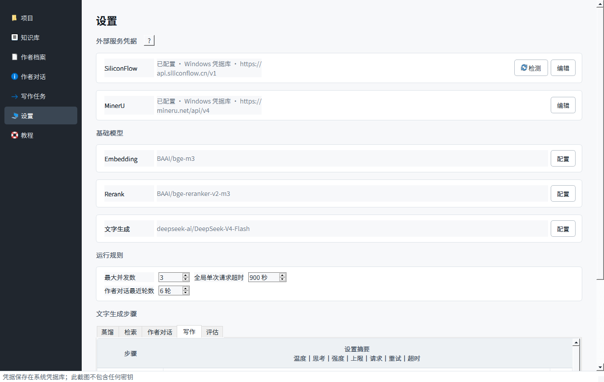
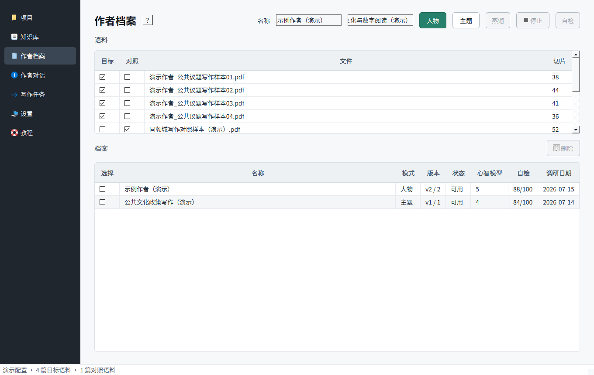
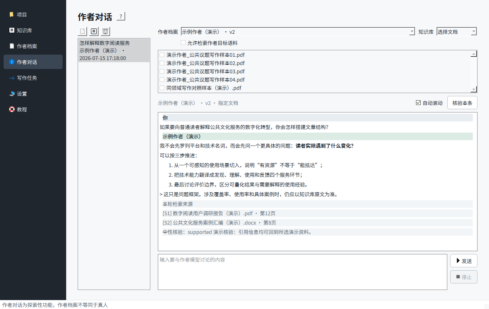
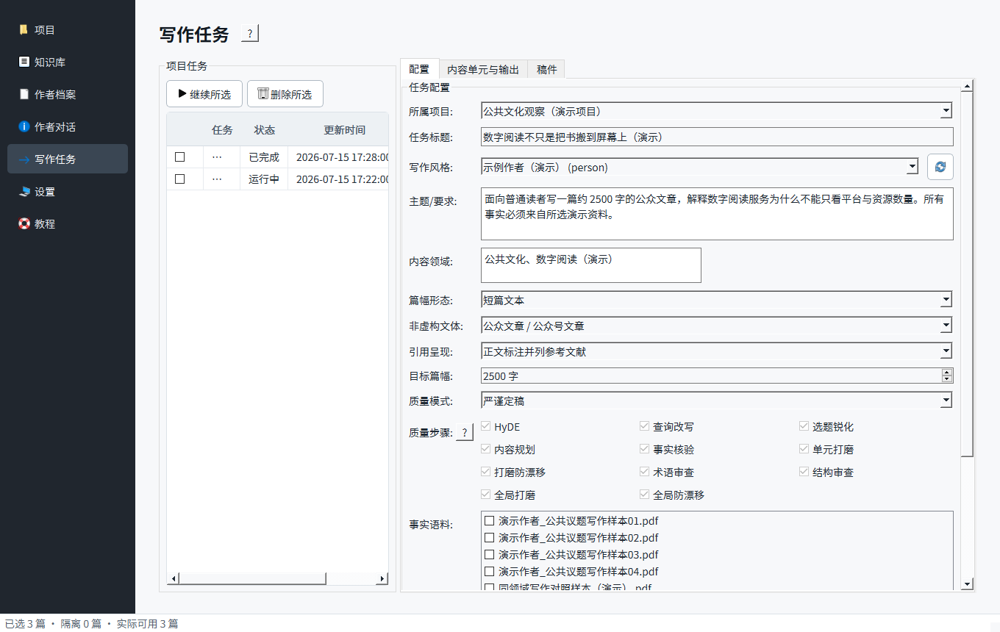
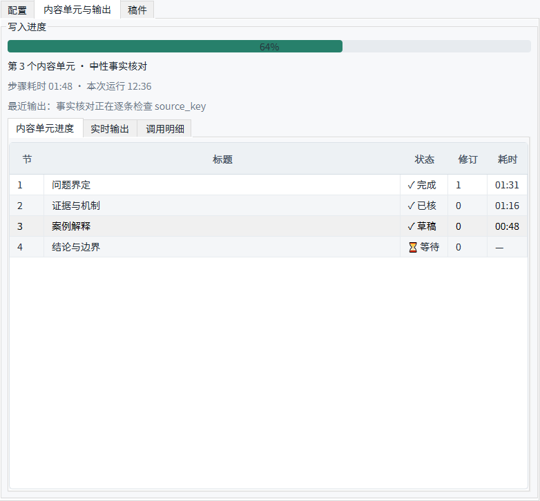
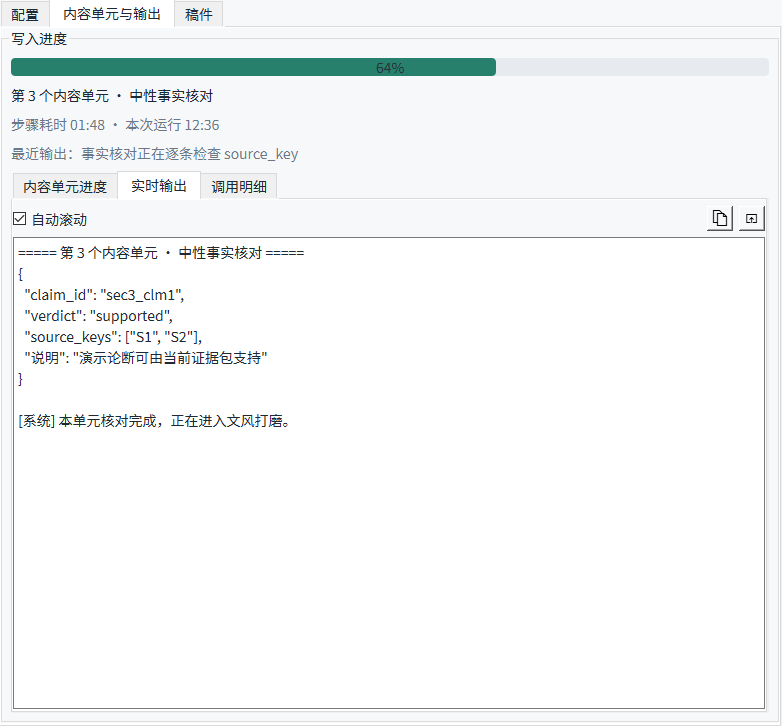
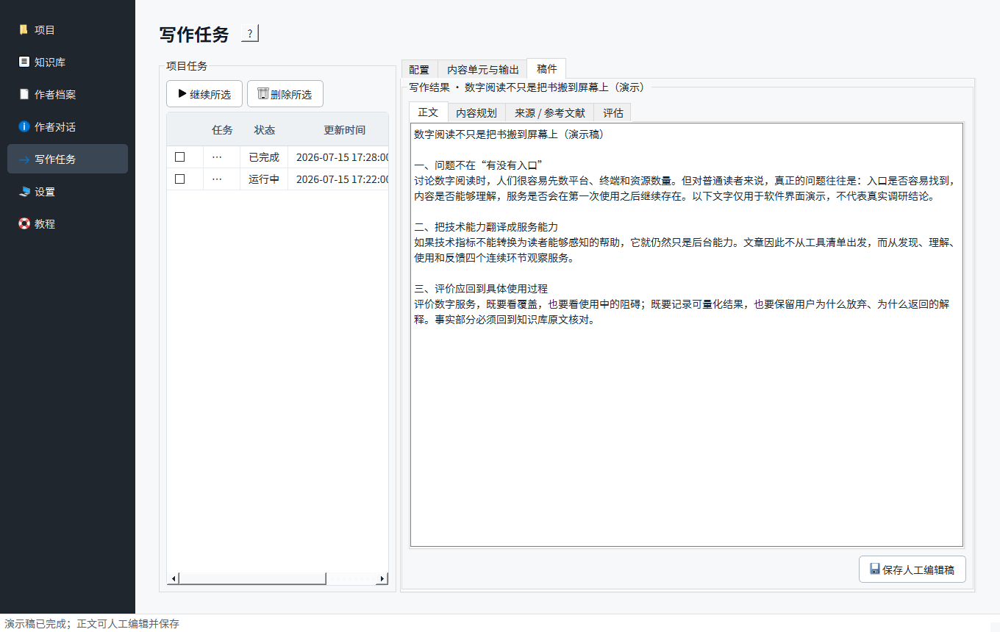
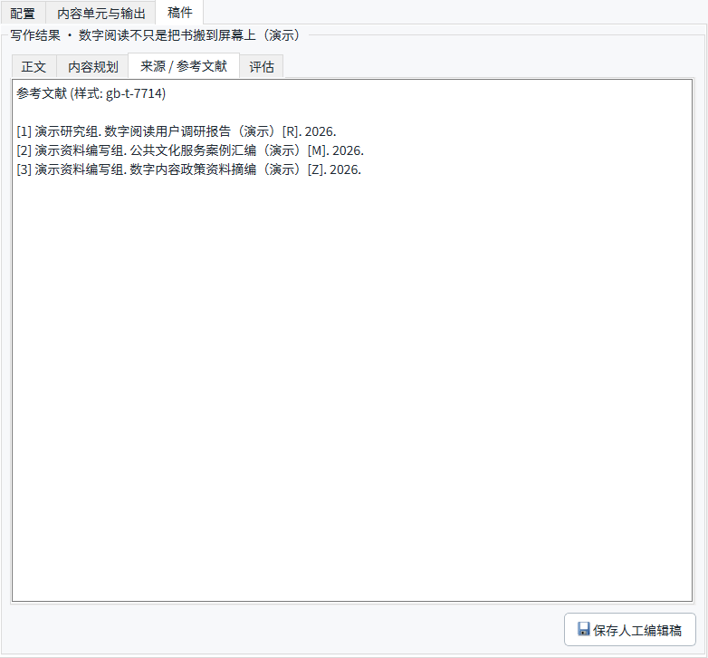

<!--
发布前设置：
1. 公众号封面使用 images/00-cover.png（900×383），不必重复插入正文。
2. 将“阅读原文”设置为 Parrofish 的 GitHub Releases 页面。
3. 发布前确认 Releases 中已经上传 Setup、Portable、Source 和 SHA256SUMS 四个文件。
4. 本文截图全部使用虚构演示数据，不包含真实语料、作者档案、任务记录或 API 密钥。
-->

# 刚开发了一个专业写作软件

最近需要处理的论文、报告和公众号文章越来越多，我也试过直接让大模型帮我写，但用久了总觉得还缺点什么。

一方面，它确实可以很快生成一篇“看起来像文章”的东西；另一方面，资料一多，它就容易把作者的旧观点、当前任务的事实材料和模型自己的补充混在一起。至于某句话到底来自哪里、引用有没有真的支持论断，往往还得自己重新查一遍。

所以我想做一个稍微不一样的写作软件：它可以从一批文章中学习某位作者怎样思考、怎样谋篇、怎样表达，但新文章使用的事实和证据必须来自另一组明确选择的资料。

现在基本做完了，名字叫 **Parrofish**。

大概是这么个效果：上面是已经入库的资料，下面可以直接测试检索结果来自哪篇文档、哪个章节和哪一页。

图中的文件名、检索结果和正文都是虚构演示数据。

首先介绍一下功能和操作方法，后面再说开发过程。

**下载链接（Windows 安装包、免安装版和源码见文末“阅读原文”）**

## 核心功能

1. 可以批量导入 PDF、Word、PPT 和 TXT，建立一个本地知识库。
2. 可以用多篇文章蒸馏作者，提炼心智模型、表达 DNA 和谋篇 DNA，而不只是模仿几个口头禅。
3. 作者档案只负责“怎么想、怎么组织、怎么表达”，知识库只负责事实、证据和引用，两条通道默认隔离。
4. 不只支持论文，也支持研究报告、政策简报、评论、书评、科普、演讲、公众号文章、教程、摘要等非虚构文本。
5. 写作前先检索证据，事实论断需要绑定来源；核对不过会修改或停止，不会硬凑出一篇“完成稿”。
6. 自带“作者对话”，可以先和蒸馏出来的作者模型讨论问题，也可以选择是否使用知识库。
7. 蒸馏和写作都支持实时输出、步骤耗时和断点续跑，长任务中断后不必全部重来。
8. SiliconFlow 的模型、并发、超时、temperature、thinking、max_tokens、流式请求和重试次数都可以在设置里调整。

## 操作方法

### （1）先设置 API

程序本身不附带模型，也没有把一个大模型塞进安装包里。

文档解析使用 MinerU，文字生成、向量化和重排使用 SiliconFlow，所以第一次打开程序后，需要先到“设置”里填写两个 API。

SiliconFlow 可以通过这个邀请链接注册：

https://cloud.siliconflow.cn/i/j7F36Uco

使用邀请链接注册可以获得免费额度。注册后进入“API 密钥”，新建并复制以 `sk-` 开头的密钥。

MinerU 官网：

https://mineru.net/

登录后进入“API → API 管理”，创建 Token 即可。

密钥只需要粘贴到软件设置页。Parrofish 会把它们保存到 Windows 凭据库，而不是普通配置文件里。截图、日志和公开仓库里也不会显示密钥。

设置页还能选择 chat、embedding 和 rerank 模型。每个文字生成步骤可以单独调参数，所有 SiliconFlow 调用则共同受一个全局并发数和单次超时限制。

### （2）建立知识库

在“知识库”点击“批量导入”，可以一次选择多个文件。

PDF、Word 和 PPT 会交给 MinerU 解析，TXT 使用本地解析。程序会尽量保留页码、章节层级、字符位置和父子切片，再同时建立向量索引与 BM25/jieba 索引。

知识库下面有一个检索测试区。输入问题后，程序会综合语义检索、关键词检索、RRF 融合和 rerank，返回原文所在的文档、章节、页码和文本预览。

这样做的目的不是把检索过程弄复杂，而是让后面的事实论断还能回到真实小块，而不是只知道“模型好像从某篇文档里看过”。

MinerU 有每日文件数和优先页数限制，所以批量入库时会按顺序解析，不会为了快而无节制并发调用。

### （3）蒸馏作者

知识库建好后，可以到“作者档案”选择语料。

“目标”是要学习的作者文章；“对照”是同领域或同文体的其他文章。对照语料不是必填，但它可以帮助程序判断：某个写法到底是这个作者比较特别，还是同类文章都这样写。

蒸馏分为 Map 和 Reduce。Map 先逐篇、逐块提取观察；Reduce 再回到全部语料，判断哪些模式能跨文档复现，哪些只出现在一篇文章里，哪些其实只是通用写作惯例。

最终档案主要包括三部分：

1. **心智模型**：作者怎样发现问题、解释因果、选择证据、处理反方意见和适用边界。
2. **表达 DNA**：句式、节奏、概念密度、常用转折、禁忌词和容易出现的口癖。
3. **谋篇 DNA**：全文、章节、段落、句群和过渡之间怎样组织，不会把“固定几个章节”直接当成永远适用的模板。

同一批语料生成一个顶层档案，新蒸馏会保存为新版本。核心列表优先保留 3—7 个个性化模型，通用惯例单独放置；矛盾和信息不足不会被自动编圆。

蒸馏通常是比较耗时的一步，因为它真的需要读完多篇文章。Map 可以并发，阶段结果也会逐步保存；中途停止后，再次运行可以复用已经完成的部分。

双击档案还可以查看完整 JSON、Markdown、运行时档案和版本历史。完整档案里的文档、切片和页码锚点只用于审计，真正写作时会使用去掉旧语料证据的“运行时投影”，避免作者旧文章混进新任务的事实材料。

### （4）和作者模型对话

蒸馏完成后，可以先到“作者对话”里试着讨论一个问题。

作者对话可以不使用知识库，也可以检索全部或指定文档。回答支持 Markdown 显示，历史消息会保存在本地；较早内容由滚动摘要承接，最近几轮则按设置原样上传。

如果使用了知识库，回答下面会显示本轮检索来源，也可以单独点击“核验本条”。

但这个功能仍然只是探索性讨论。蒸馏出来的是一份基于特定语料和调研日期的作者模型，不是真人，也不代表作者没有公开过的想法。它比较适合帮助梳理问题，不应该拿来伪造作者本人发言。

### （5）创建写作任务

正式写作在“写作任务”页面进行。

这里可以选择项目、作者档案、文体、篇幅、引用呈现、事实语料和质量模式。

质量步骤按照实际写作顺序排列，包括 HyDE、查询改写、选题锐化、内容规划、事实核验、单元打磨、防漂移、术语审查、结构审查和全局打磨等。觉得太慢时，可以切到平衡模式或快速草稿，也可以自己勾选。

事实语料下面会直接显示“已选几篇、隔离几篇、实际可用几篇”。作者的目标语料默认隔离；确实需要引用作者原文时，才手动打开允许复用。

开始后，程序按内容单元逐步写作。进度条代表整个任务，下面还能看到每个单元目前是等待、草稿、已核验还是已经打磨，以及分别用了多久。

模型正在返回什么也可以实时看见，不用盯着一个不动的进度条猜它是不是卡住了。

流式请求如果中途断开，程序会检查 `[DONE]`、响应长度和结构完整性。截断结果不会当成成功缓存；重试时也会隔离上一轮坏流，避免把两次 JSON 拼在一起。

已经完成的章节会逐步保存。“继续所选”会从断点接着写，而不是每次都从第一步重来。

写作完成后，正文、内容规划、来源和评估分别放在不同标签页。正文可以人工修改并保存。

正式引用不是模型自己敲出来的。模型只返回内部 `source_key`，程序再根据正文实际使用并且核对通过的来源，用 citeproc-py 按 GB/T 7714 拼装参考文献。

如果事实核对仍有 `partial` 或 `unsupported`，程序会尝试修订；达到上限仍不通过，就停在失败状态，让用户决定怎样处理，而不是为了显示 100% 强行生成成稿。

## 开发流程

这个软件比我之前做的桌面日历复杂很多，所以开工前我先写了两份交底文档。

一份是项目说明书，规定要做作者蒸馏、知识库和生成流水线；另一份是开发规范，规定模块怎么拆、API 怎么统一封装、任务怎样断点续跑、PyQt 怎样避免卡死、测试怎样跟着阶段走。

其中有八条设计铁律，我觉得最重要的几条是：

1. 作者档案只管形式，知识库只管事实。
2. 先检索，后写作。
3. 事实先冻结，文风最后加。
4. 不让“作者”自己核对自己。
5. 引用由代码拼装，不让模型手敲。

之后我和 Codex 按阶段开发：先搭项目骨架和统一 API 客户端，再做 MinerU 入库、LanceDB 与 BM25 双索引，然后做作者蒸馏、混合检索、写作循环、事实核对、引用、一致性、评估和完整 PyQt 界面。

作者蒸馏的方法参考了 Nüwa，但程序运行时不需要安装 Nüwa，而是自己实现 Map—Reduce 和运行时作者档案。

这期间我用多篇真实文档反复测试过蒸馏、检索和长文写作，也遇到过流式响应没有 `[DONE]`、JSON 被截断、事实核对循环、断点恢复后重复起草、进度条回退等问题。现在这些地方都分别增加了完整性检查、坏缓存隔离、恢复修订和持久化状态。

最后用 PyInstaller 和 Inno Setup 打成 Windows 安装包。程序使用 Windows GUI 子系统，打开时不会附带一个黑色控制台窗口。

目前离线测试是 228 项通过；3 项会消耗真实 API 额度的集成测试默认跳过，需要显式开启才会运行。

## 数据保存

普通安装版的数据默认保存在：

`%LOCALAPPDATA%\Parrofish`

这里包括知识库、作者档案、对话、项目任务、稿件和断点。卸载软件时不会自动删除这些数据，避免一不小心把长期积累的资料一起删掉。

API 密钥保存在 Windows 凭据库，不和这些普通数据混在一起。

需要说明的是，Parrofish 不是完全离线软件。用户主动选择的文档内容和提示词会按照功能需要发送给 MinerU 或 SiliconFlow，所以不要导入无权处理的材料，也要留意所在单位对敏感资料的规定。

## 目前的限制

1. 当前只打包了 Windows 10/11 x64 版本。
2. 文档解析和模型调用依赖 MinerU、SiliconFlow 的网络与额度；长篇蒸馏、严谨定稿确实可能需要较长时间。
3. 作者档案的质量取决于语料。只放一两篇文章时，很多观察只能算暂定，不能当作稳定的作者特征。
4. 目前是 `v0.1.0`，书目信息补全、导出格式、跨平台和更多易用性细节还可以继续完善。
5. 安装包暂时没有购买商业代码签名证书，第一次运行时 Windows 可能弹出 SmartScreen 提示。
6. 这个软件定位是非虚构写作助手，不负责替用户规避著作权、署名和学术诚信要求。

程序源码采用 GPLv3+ 协议开源。用户导入的文档、建立的知识库和生成的内容，不会仅仅因为使用 Parrofish 就自动适用 GPL，但用户仍然要对材料和内容的合法使用负责。

使用中如果遇到问题，欢迎在评论区留言，或者到 GitHub 提 Issue。

**下载链接（`Parrofish-Setup-0.1.0-x64.exe`、免安装版、源码和 SHA-256 校验文件见“阅读原文”）**
